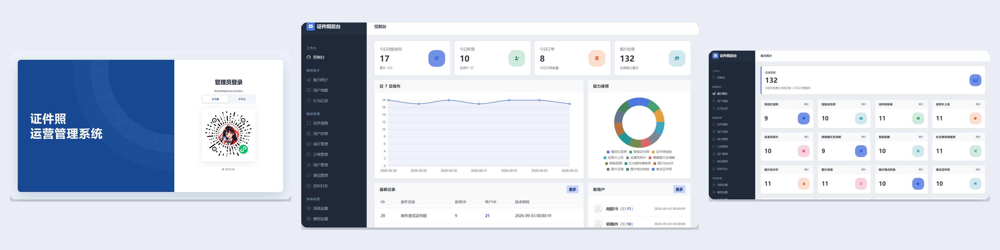
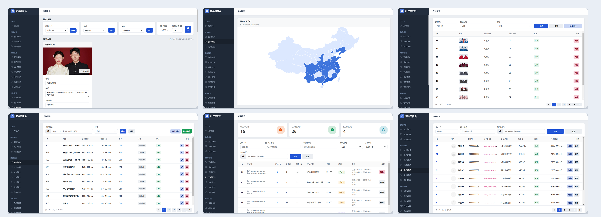
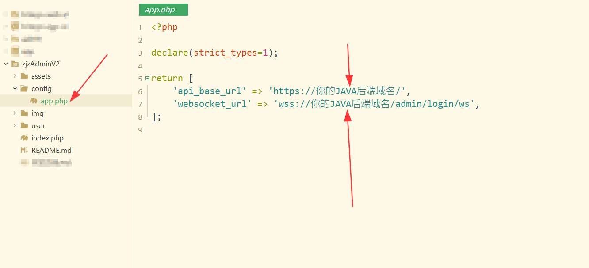
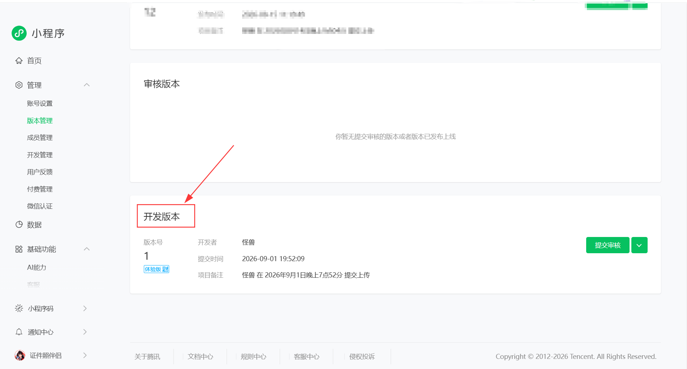
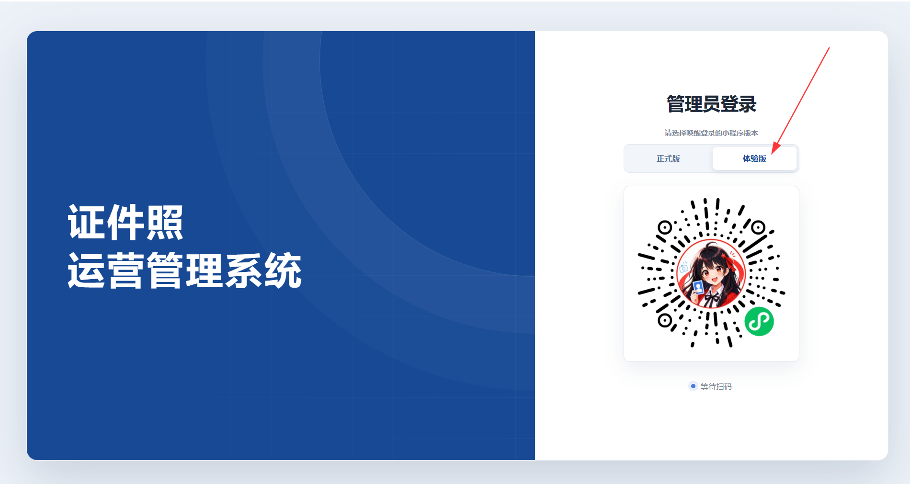

# 项目介绍

# 
小程序管理员后台

让大家久等了，V2版本终于和大家见面了！

**相关项目**：

- 小程序前端V2请前往：https://github.com/no1yu/photoOneV2
- 小程序后端V2请前往：https://github.com/no1yu/HivisionIDPhotos-wechat-weappV2

------

# ⭐最近更新
- 2026.10.06：增加虚拟支付
- 2026.09.01：V2版本正式发布

 

# 🔧部署

打开config/app.php，修改2个地址就好啦
 
然后上传到服务器部署PHP8.2程序即可

 

# ⚡️注意事项
1. 默认使用小程序第一个注册（id=1）的当作管理员，其它用户均无法登录管理员后台
3. 小程序没发布到线上版本时，需要把小程序上传到开发版，然后登录时选择体验版即可

 

## 📧其它

您可以通过以下方式联系我:

QQ: 24677102

微信：webxuan

QQ群：151601935